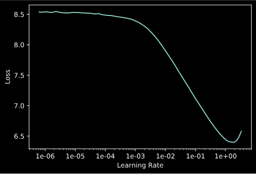
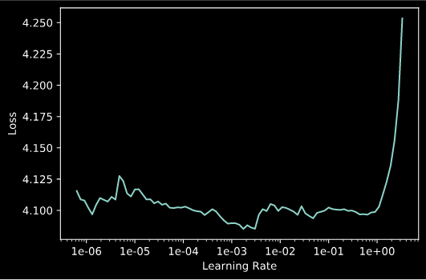
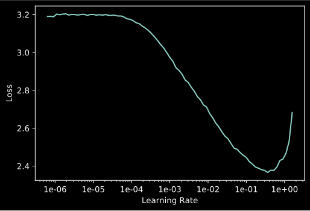
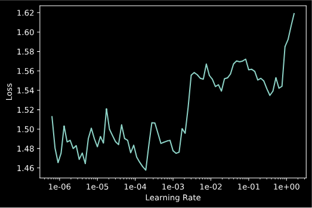

## Data

The training data is from kaggle's [Recipe Ingredients Dataset](https://www.kaggle.com/kaggle/recipe-ingredients-dataset).

## Modelling

My first take is to use some classifiers out of the box from scikit-learn even without any hyperparameter tuning. The result seems acceptable. Checkout the [scikit-learn script](https://github.com/zehengl/ez-cuisine-classifier/blob/master/try_sklearn.py).

|                mean accuracy                |           learner           |
| :-----------------------------------------: | :-------------------------: |
|                    0.716                    |         BernoulliNB         |
|                    0.619                    |   DecisionTreeClassifier    |
|                    0.099                    |       DummyClassifier       |
|                    0.530                    |     ExtraTreeClassifier     |
|                    0.730                    |    KNeighborsClassifier     |
| <strong style="color:green;">0.790</strong> |          LinearSVC          |
|                    0.673                    |        MultinomialNB        |
|                    0.763                    | PassiveAggressiveClassifier |
|                    0.720                    |         Perceptron          |
|                    0.759                    |       RidgeClassifier       |
|                    0.777                    |        SGDClassifier        |
|                    0.775                    |     LogisticRegression      |
|  <strong style="color:red;">0.197</strong>  |             SVC             |

I have noticed the SVM's `rbf` kernel does not work with default parameters. Hence I try out a few penalty values and the results are better, shown as follow.

|               mean accuracy               |   learner    |
| :---------------------------------------: | :----------: |
| <strong style="color:red;">0.197</strong> |  SVC (C=1)   |
|                   0.489                   |  SVC (C=10)  |
|                   0.706                   | SVC (C=100)  |
|                   0.784                   | SVC (C=1000) |

## Another approach of modelling

Transfer learning is a trending topic nowadays in machine learning domain. It allows us to take advantage of pre-trained models and fine tune them for another domain/task.
This dataset may not be the best case to apply transfer learning practise because the ingreidents are not written in natural language. I did it anyway for the sake of demonstration.
For simplicity, I choose **fast.ai**.

**fast.ai**'s learning rate finding function is pretty handy. And I only use the 1cycle policy to fit the model. Checkout the [language model script](https://github.com/zehengl/ez-cuisine-classifier/blob/master/try_language_models.py).

### Fine tune the pre-trained model

Choosing learning rate 0.

| epoch | train_loss | valid_loss | accuracy | time  |
| :---: | :--------: | ---------- | -------- | ----- |
|   0   |  4.911732  | 3.926325   | 0.341775 | 00:14 |

To train a bit further, choose learning rate (1e-2)/2.

| epoch | train_loss | valid_loss | accuracy | time  |
| :---: | :--------: | ---------- | -------- | ----- |
|   0   |  3.331526  | 3.207970   | 0.397344 | 00:19 |

### Apply the tuned model for classification

Choosing learning rate 5e-1.

| epoch | train_loss | valid_loss | accuracy | time  |
| :---: | :--------: | ---------- | -------- | ----- |
|   0   |  1.524449  | 1.477003   | 0.578630 | 02:51 |

To train a bit further, choose learning rate 2e-4.

| epoch | train_loss | valid_loss | accuracy | time  |
| :---: | :--------: | ---------- | -------- | ----- |
|   0   |  1.284334  | 1.164963   | 0.652546 | 03:09 |

### Explanation

- Accuracy being about 40% after fine tuning means that the tuned language model is able to predict the next word based on context 2 out of 5 times.
  For example, `lm_learner.predict("green bell")` would return `"green bell pepper"`.

- Accuracy being about 65% after fitting for classification means that the classifier is able to predict the correct cuisine based on input ingredients 3 out of 5 times.
  For example, `clf.predict("warp avacado beef")` would return `"southern_us"`.

## Demo

Demo with **LinearSVC** model is available at [https://ez-cuisine-classifier.herokuapp.com](https://ez-cuisine-classifier.herokuapp.com/).
