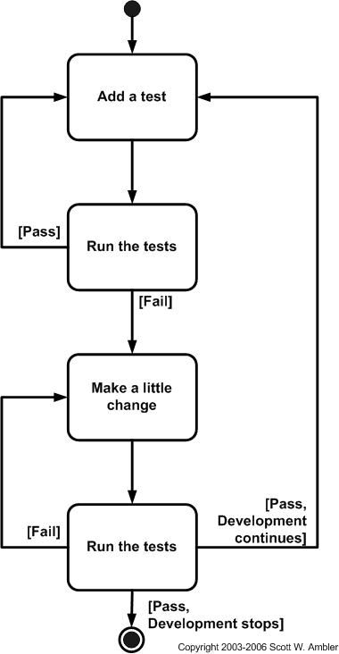

# Agile Scrum Note 06

Scrum best practices you should know

<!-- more -->

## Continuous Refactoring

<!-- prettier-ignore -->
- Cleaning up the code (changes that do not change the expected inputs or outputs) for one or more of the following reasons:
    - Better readability
    - Optimizing processing logic
    - Improving maintainability
    - Improving performance
    - Complying with design guidelines and framework
- Re-factoring is a best practice - particularly important in Agile, as the code gets built incrementally
- The team should write re-factoring stories and request the Product owner to prioritize
- Extreme Programming advocates continuous re-factoring
    - Remember the Agile principle: "Continuous attention to technical excellence and good design enhances agility"

## Pair Programming

<!-- prettier-ignore -->
- Two people looking at one machine with one keyboard and one mouse
    - One driver and one navigator
    - One implements, one strategizes
    - All code written in pairs
- Produces 15% less output, but:
    - Leads to better design, quality
    - Succession planning
    - Training opportunities
- Especially useful while
    - Writing complex logic
    - Debugging "hard-to-solve" problems

## Continuous Integration

<!-- prettier-ignore -->
- Originated with the Extreme Programming development process, as one of its original twelve practices.
- Continuous integration is an approach that keeps everybody's code integrated and builds release infrastructure along with the rest of the application.
- Practices of continuous integration
    - Maintain a single source repository
    - Automate the build
    - Make your build self- testing
    - Everyone commits to the mainline every day
    - Every commit should build the mainline on an integration machine
    - Keep the build fast
    - Test in a clone of the production environment
    - Make it easy for anyone to get the latest executable
    - Everyone can see what's happening
    - Automate deployment

## Configuration Management

<!-- prettier-ignore -->
- Best practices
    - Invest in automation tools (automate the build, automate the tests)
    - Enforce discipline in code check-ins (mandatory code review workflow, mandatory tests and code coverage reports)
    - Use static code analyzers
    - Use tools that allow multiple check-outs and safe merges
- Hire a good configuration manager to automate and then recede into the background

## Quality in Agile

<!-- prettier-ignore -->
- Quality is defined as "conformance to specifications and fitness of purpose"
    - Extrinsic or Customer perceived quality is perceived when the product is delivered to the customer and measured by the extent to which they realize "value" from it
    - Intrinsic or Technical quality is the quality that is perceived by the team
    - Technical quality has many facets including modularity, maintainability, scalability, reliability, etc.
    - Extrinsic quality is non-negotiable, but Intrinsic quality is also critical to ensure that you can continue to deliver value

## Scrum Quality - Home truths

- Building in "near releasable quality" Sprint after Sprint is **DIFFICULT** - but it is an important goal
- There is no separate QA team - there is ONE team and each member of the team is responsible for quality
- Quality has to be built into the development process
- Be prepared to make a heavy investment in automated testing
- Inspections have to be early and continuous - the later you give feedback, the harder (and costlier) it is to fix
- Inspections must incorporate verification (are we building the product right) and validation (are we building the right product)

## Test Driven Development (TDD)

<!-- prettier-ignore -->
- The goal of every team should be to move towards Test-Driven Development
- Also known as Test first programming
- It is an evolutionary (iterative and incremental) approach to programming where agile software developers must first write a test that fails before they write new functional code.
- When adding a feature, a pair may perform dozens of these cycles, implementing and refining the software in baby steps until there is nothing left to add and nothing left to take away.
- Step:
    1. Quickly add a test, basically just enough code to so that the tests now fail.
    2. Run the tests, often the complete test suite, although for sake of speed they may run only a subset to ensure that the new test does in fact fail.
    3. Update the functional code so it passes the new test.
    4. Run the tests again.
    5. If the tests fail return to step 3.
    6. Once the tests pass the next step is to start over (agilists may also want to refactor any duplication out of their design as needed).

<!-- prettier-ignore -->
- Advantages of TDD:
    - TDD forces developers to do detailed design just in time (JIT) before writing the code.
    - It ensures that agile developers have testing code available to validate their work, ensuring that they test as often and early as possible.
    - It gives developers the courage to refactor their code to keep it the highest quality possible, because they know there is a test suite in place that will detect if they have "broken" anything as the result of refactoring.
    - Research shows that TDD substantially reduces the incidence of defects [Janzen & Saiedian].
    - It also helps improve your design, documents your public interfaces, and guards against future mistakes.

## Done criteria

<!-- prettier-ignore -->
- It is a good idea to clearly define the meaning of the term "Done"
- The Scrum Master can help the team come up with these guidelines
- For example, a story can be DONE when:
    - Design is completed and reviewed by the architect
    - Coding is completed for 100% of the paths described in the story
    - Testing is completed for the story
    - Regression testing is done to ensure no unexpected impacts
    - All identified bugs are fixed
    - Technical and user documentation is updated for the added/changed functionality
- Similarly, you can define _DONE_ criteria for Sprints or Releases
