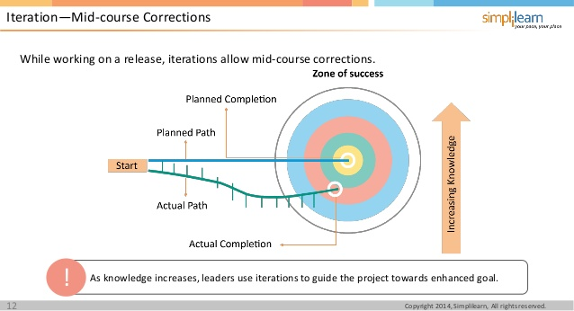
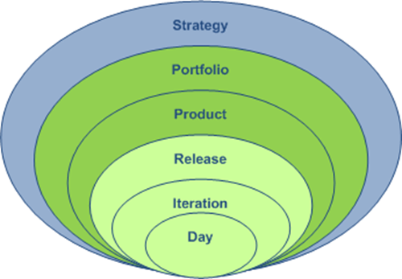
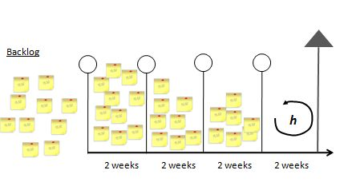
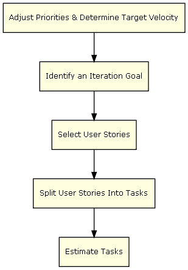

# Agile Scrum Note 07

Information about Scrum planning

<!-- more -->

## Principles behind Agile planning

- Planning in Agile is considered as a "Speculative" activity, i.e., you make a forecast that is reasonable, based on the available information
- The plan is elaborated and becomes more and more definitive over a period of time
- Normally on Agile projects, you plan based on "time-boxes", i.e., fix the time and resources available and determine the features that can be delivered
- The plan has to be flexible and planning is an on-going activity
- Try not to pack too much into the plan - allow space to accommodate changes

## Iterations allow for mid-course corrections

## Multiple levels of planning

- Iteration planning considers the tasks that are needed to transform a **Feature Request** into working, tested software
- Iteration Planning occurs at the start of each iteration
- Product Planning involves a product owner looking ahead than the immediate release and planning for the evolution of released system
- Portfolio planning involves the selection of the products that will best implement a vision established through an organization's strategic planning

## Release planning

A Release Plan presents a roadmap of how the team intends to achieve the product vision within the project objectives and constraints identified up-front

- It helps the product owner and the whole team decide how much must be developed and how long that will take before they have a releasable product
- A release conveys expectations about what is likely to be developed and in what timeframe
- A release plan serves as a guidepost toward which the project team can progress

## Steps to planning a release

The team and product owner collaboratively explore the product owner's conditions of satisfaction that include scope, schedule, budget, and quality.

## Release Planning

The purpose of Release Planning is to define the contents of a release or a specific shippable product increment.

## Velocity

- Velocity is a measure of a team's rate of progress per Sprint
- It is calculated by summing the number of story points assigned to each user story that the team **completed** during the Sprint.

## Sprint planning

<!-- prettier-ignore -->
- The Goal of Sprint planning is for the team to make a "good commitment" about what they will deliver at the end of the Sprint
- A "good commitment" means:
    - Everybody is clear about the goals
    - Everybody agrees that it is "achievable"
- It should be achievable without sacrificing:
    - Sustainable pace
    - Quality (near releasable quality)
- A Sprint pre-planning meeting and preparations would help

## Velocity driven sprint planning

## Commitment driven sprint planning

In Commitment driven sprint planning, the team is asked to add stories to the sprint one-by-one until they can commit to completing no more.

## Find out how much time is available

Allow time for:

- Hacking, reading blogs, 20% time?
- Lunch, tea breaks
- Email
- Meetings
- Fixing P1 bugs from previous version
- Time committed to other teams

## Planning for each story

<!-- prettier-ignore -->
- Find out what "tasks" are needed
    - Design / Design review
    - Code
    - Unit test
    - System and regression test
    - Documentation
    - Bug fixing
- Assign tasks to resources and re-estimate the tasks
- Make sure the team member has time available

## Keep in mind before finalizing the plan

- Does everybody in the team have enough (not too little and not too much) work to do?
- Have you considered correct capacity (e.g. account for planned leaves)?
- Do you have some buffer to accommodate unplanned absence or other contingencies?
- Have you kept time aside for Scrum rituals: Planning, Stand-ups, Review, Retrospective?
- Do you understand the dependencies and have they been tied up?
