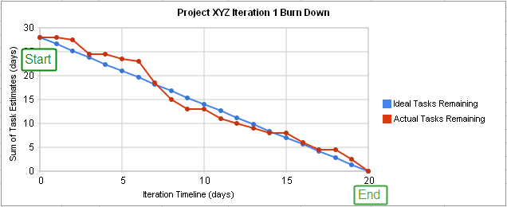
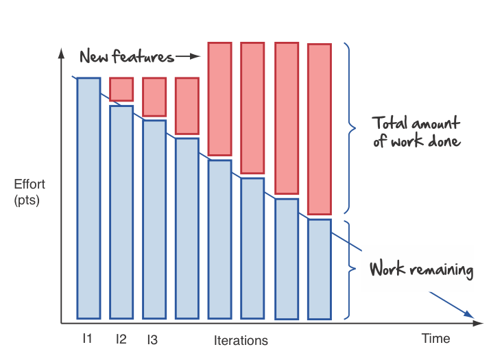
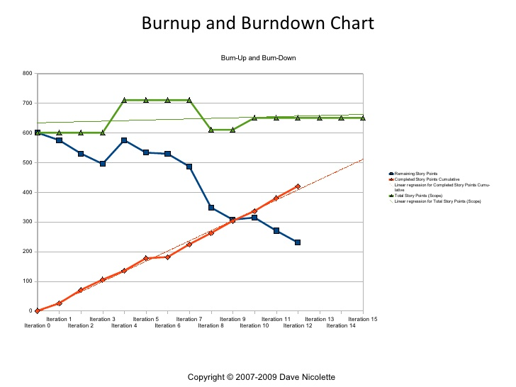
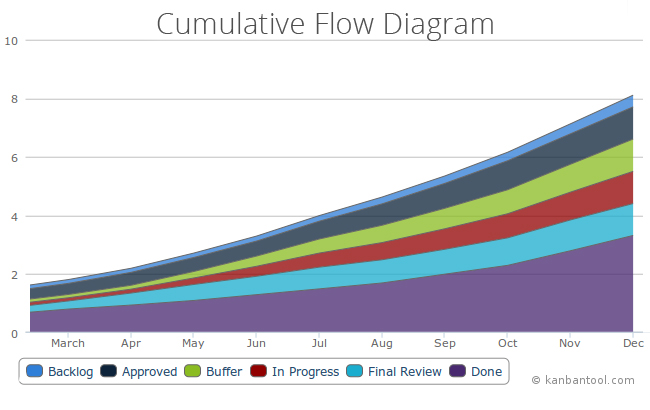
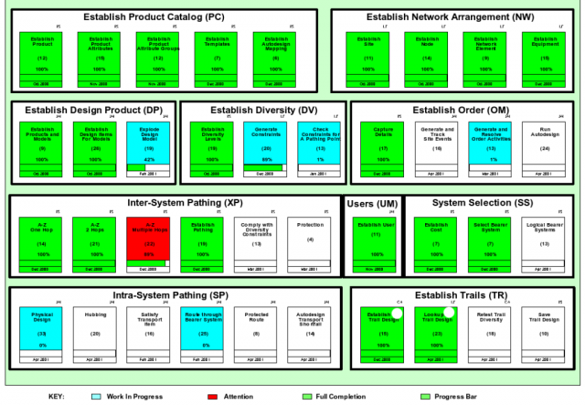
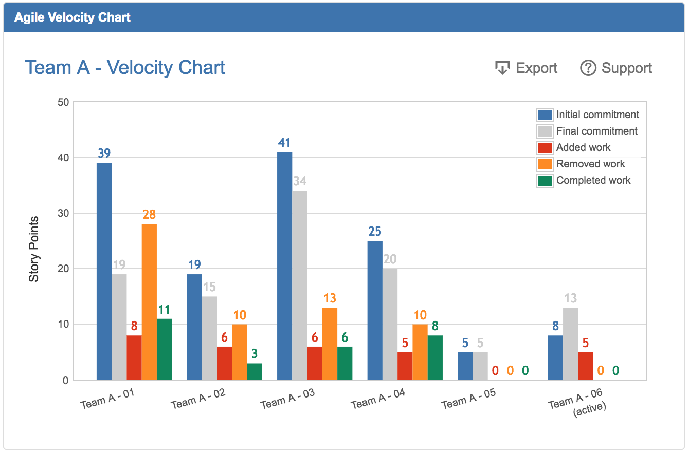
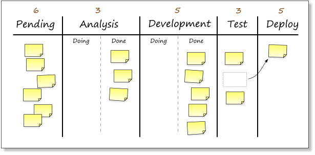
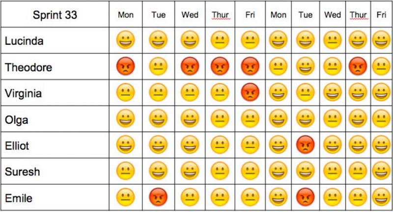
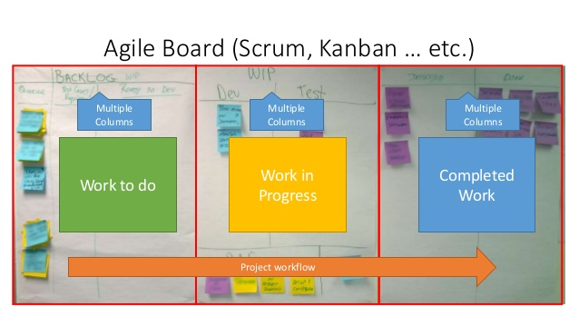
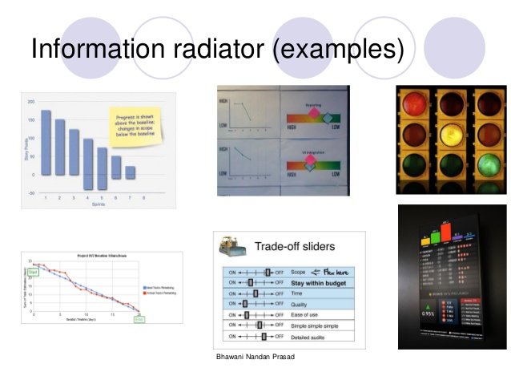

# Agile Scrum Note 09

Tools and techniques to monitor Scrum projects

<!-- more -->

## Principles in monitoring Scrum Projects

<!-- prettier-ignore -->
- Ideally, the TEAM should monitor its own progress
    - The manager or Scrum Master should NOT micro- manage
- The Scrum Master should try to provide the team visibility so that they can make informed decisions
- Common tracking mechanisms in Scrum
    - Daily stand-up meetings
    - Reviews and retrospectives
    - Metrics
    - Charts
    - Information radiators

## Metrics

<!-- prettier-ignore -->
- A metric is a standard for measuring or evaluating something.
- A measure is a quantity, a proportion, or a qualitative comparison of some kind.
    - Quantity: "There are 25 open defect reports on the application as of today."
    - Proportion: "This week there are 10 percent fewer open defect reports than last week."
    - Qualitative comparison: "The new version of the software is easier to use than the old version."
- Types of metrics
    - Business
        - RTF (Running Tested Features)
        - Earned Business Value (EBV)
        - Net Present Value (NPV)
        - Internal Rate of Return (IRR)
        - Return on Investment (ROI)
    - Process
        - Impediments cleared per iteration
        - Impediments & User stories carried over the next iteration
        - User stories done per iteration
        - Defects carried over the next iteration
        - Team member loading
        - Velocity
        - Backlog size
    - Project Testing
        - Acceptance tests per story
        - Defects count per story
        - Escaped Defects per cycle
        - Tests time to run
        - Tests run per frequency
        - Time to fix tests
    - Do's and Don'ts
        - Measure only a few things that matter (just because it can be measured doesn’t mean it is important)
        - It should be easy to calculate (ideally an automated process)
            - If it is too cumbersome, either people won’t do it or it will be incorrect
        - It should be easy to explain and interpret
        - It should result in tangible action
            - Behavior that you want to encourage OR
            - Behavior that you want to discourage
        - Use metrics to guide action, not for witch-hunts
        - In Scrum, team metrics are preferred
        - Do NOT use metrics for performance appraisals
            - It will usually result in perverse incentive to manipulate the number

## Charts in Scrum

<!-- prettier-ignore -->
- Commonly used charts:
    - Burn-down, Burn-up charts
    - Cumulative Flow Diagrams
    - Progress Charts
    - Risk profile graphs
    - Others
- Charts are useful because:
    - It indicates trends (trends are more important than absolute numbers)
    - It is more "visual" (a picture is worth a thousand words)
    - Management loves charts!

## Burn-down Chart

## Burn-down Chart Bar Style

## Burn-up and Burn-down Chart

## Cumulative Flow Diagram

## Parking Lot Diagram

## Escaped defects found

Escaped Defects Found counts number of new escaped defects found over period of time (day, week, month).

## Velocity Chart

## Progress Chart / Kanban

## Niko Niko Calendar

## Information radiators

"An information radiator displays information in a place where passers by can see it. With information radiators, the passers by don't need to ask any question; the information simply hits them as they pass."

- Invented by Alistair Cockburn
- Team members can view the current state of the project : schedules, tasks, progress, issues
- Scrum teams should use it to make progress (or lack of) visible

Most popular Information radiators are:

- Task Boards
- Big Visible charts (Includes burn down charts)
- Continuous Integration build health Indicators (Including lava lamps and street lights)

Effective Information Radiators should be :

- **Simple**: Should be Brief and concise.
- **Stark**: Should display the progress and expose problems. Errors should not be masked, rather used to improve the work and performance
- **Current**: Information displayed should be current
- **Transient**: The problems and errors shouldn't be there on the chart for long; once the problem has been rectified, it should be taken off
- **Influential**: Influences the team members and management and empowers the whole team to take decisions
- **Highly** visible
- **Minimal** in number
