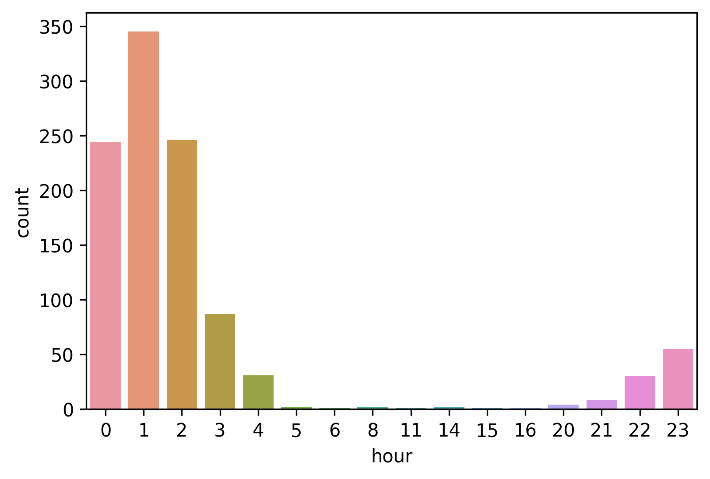
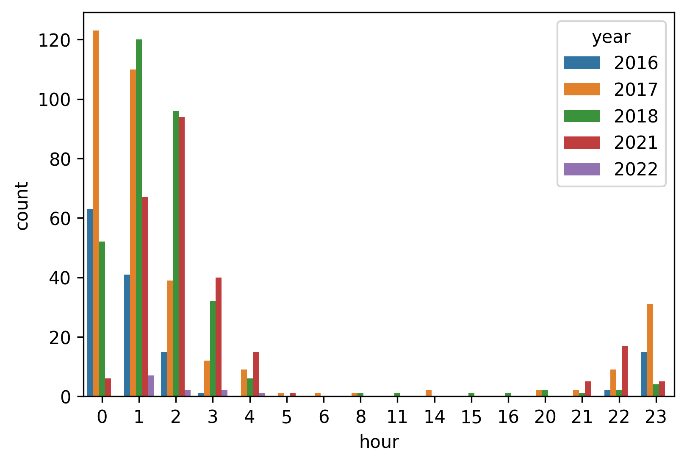

# Better Go to Bed Earlier

I exported my data from Fitbit and used a little bit of Python to inspect my sleep records.
The code is available on [GitHub](https://github.com/zehengl/fitbit-visualization).

<!-- more -->

## What time do I usually go to bed?

I rarely go to bed before midnight and data says so.

## Further Breakdown by Year

Looks like I stayed up late most of the time in 2021.

